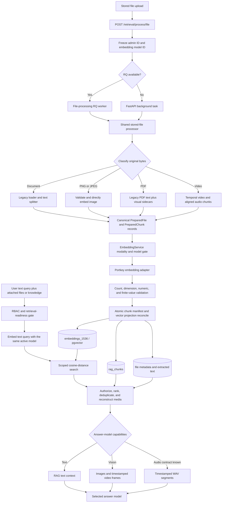

# Current Multimodal RAG Pipeline Architecture

## Purpose and scope

This document describes the multimodal retrieval-augmented generation (RAG)
pipeline implemented in the current working tree. It is intended as a reference
for developers who need to diagnose, extend, or replace part of the pipeline.

The implementation supports four embedding modalities in one model-aware vector
space:

- Text extracted from ordinary documents and PDFs.
- Standalone PNG and JPEG images.
- Images and rendered tables extracted from mixed text/image PDFs.
- Temporal video segments, plus time-aligned audio segments derived from a
  video's meaningful audio track.

The pipeline does not use OCR, image captions, video captions, or speech-to-text
to make media searchable. Image, video, and audio bytes are embedded directly.
A text query can retrieve those media vectors because the approved multimodal
embedding model places text, image, video, and audio inputs in the same vector
space.

This distinction is central to the architecture:

- The **embedding model** converts source chunks and text queries into vectors.
- The **retrieval layer** finds nearby vectors within one authorized admin/model
  space.
- The **answer model** receives reconstructed text or media evidence after
  retrieval. Its vision and audio capabilities are independent of the embedding
  model's capabilities.

## End-to-end architecture

## Model-space ownership and selection

Each admin has one selected embedding model. Non-admin users inherit the model
of the single admin that owns their effective group context. Ambiguous or
missing admin ownership fails closed.

The `embedding_models` registry records the provider, provider model name,
dimension, supported modalities, and lifecycle status. The implemented models
are:

| Registry model | Provider | Dimension | Modalities |
|---|---|---:|---|
| `@openai-embedding/text-embedding-3-small` | Portkey | 1536 | text |
| `@vertexai/gemini-embedding-2` | Portkey | 1536 | text, image, video, audio |

The multimodal row is seeded as text/image and expanded by later migrations to
video and audio. The current storage router supports only 1536-dimensional
model-aware vectors.

Before asynchronous processing starts, the request resolves and freezes only
`admin_id` and `embedding_model_id`. Credentials, email addresses, provider
URLs, and source contents are not placed in the queue payload. The worker
reloads the model registry row and resolves the current admin credential at
execution time.

Queries and indexed chunks must use the same embedding model ID. Retrieval
cannot compare vectors from different embedding models even when both models
produce 1536-dimensional output.

Key implementation files:

- `backend/open_webui/retrieval/embedding/resolution.py`
- `backend/open_webui/retrieval/embedding/registry.py`
- `backend/open_webui/retrieval/embedding/service.py`
- `backend/open_webui/models/embeddings.py`

## Ingestion entry points and execution

The normal file-processing endpoint is implemented in
`backend/open_webui/routers/retrieval.py`. It performs access checks, prevents
duplicate dispatch with a Redis lock and database processing state, resolves the
frozen model context, and persists any explicit text override before dispatch.

Execution uses one of two mechanisms:

- `backend/open_webui/workers/file_processor.py` processes the job through RQ
  when the queue is available.
- A FastAPI background task invokes the same processing path when RQ is not
  available.

Both mechanisms call
`process_stored_file_for_embedding()` in
`backend/open_webui/retrieval/embedding/file_processing.py`. This shared
function is the canonical ordinary-ingestion transaction boundary. Code that
adds another upload or retry path should call this function instead of
constructing chunks, embedding inputs, or vector rows independently.

Admin model changes use the separate durable reindex worker in
`backend/open_webui/retrieval/embedding/worker.py`. Reindexing still calls the
same `prepare_file_for_embedding()` function and the same audio-aware embedding
helper, so ordinary ingestion and reindexing use the same modality rules.

## Canonical source and preparation recipe

Processing always reads the original file from the configured storage provider.
Cached `file.data.content` and existing vector rows are not treated as sufficient
source material for a multimodal reindex.

For a non-PDF file, an explicitly supplied text override can be persisted as the
authoritative text source. Its origin and SHA-256 digest are stored before an
asynchronous task is dispatched. PDFs always use the original stored bytes so a
text override cannot hide or replace PDF visuals.

`PreparationRecipe` in
`backend/open_webui/retrieval/embedding/preparation.py` freezes all settings
that affect extraction and chunk identity, including:

- Complex-PDF enablement and visual limits.
- Text splitter, tokenizer, chunk size, and overlap.
- Content extraction engine.
- Video segment duration, minimum trailing duration, and maximum duration.
- Extraction algorithm versions and fixed PDF rendering constants.

Reindex snapshots persist the recipe and its SHA-256 digest. A worker rejects a
snapshot if the recipe is incomplete, non-canonical, or no longer matches the
supported recipe version. Changing extraction or chunking behavior therefore
requires a deliberate recipe-version change and reindex strategy.

## Source classification and supported behavior

Byte signatures take precedence when classifying supported direct media. MIME
types and filename extensions are used as controlled fallbacks.

| Source | Implemented preparation | Direct media embeddings |
|---|---|---|
| Text, Markdown, source code, CSV, HTML, XML, EPUB, email | Legacy loader followed by text chunking | No |
| DOCX, XLS/XLSX, PPT/PPTX | Legacy loader or configured extraction service followed by text chunking | No; embedded media is not directly embedded |
| Standalone PNG or JPEG | Magic validation, dimension safety checks, and decode validation | One image vector |
| GIF, WebP, AVIF, BMP, HEIC/HEIF, SVG, TIFF | Rejected as unsupported or invalid image input | No |
| PDF with text only | Legacy PyPDF text extraction and text chunking | Text vectors |
| PDF with text, figures, and tables | Legacy text chunks plus deterministic PNG visual sidecars | Text and image vectors |
| Visual-only PDF | Deterministic visual sidecars when a multimodal model is selected | Image vectors |
| MP4, MOV/QuickTime, MPEG/MPG | Temporal video chunks plus optional aligned WAV chunks | Video and audio vectors |
| Standalone audio file | No direct typed audio preparation path | No |

Standalone images require the selected embedding model to support `image`.
Videos require the selected embedding model to support `video`. A modality gate
in `EmbeddingService` validates every prepared input again before credentials
are resolved or a provider request is made.

## Text extraction, chunking, and embedding

Ordinary documents are loaded through
`backend/open_webui/retrieval/loaders/main.py`. Depending on the file type and
configuration, the loader uses a native LangChain loader, Tika, or Azure
Document Intelligence. PDF text is forced through `PyPDFLoader` with its own
image extraction disabled.

Loaded documents are split by one of two strategies:

- Recursive character splitting is the default.
- Token splitting uses the configured tiktoken encoding.

The default chunk size is 1000 with an overlap of 200. User-scoped chunk size
and overlap settings are resolved for the governing admin. Each resulting text
chunk stores the extracted text, loader metadata, splitter settings, a text
SHA-256 digest, and a `TextEmbeddingInput`.

The Portkey adapter sends one logical text input per provider request for a
multimodal model. A text-only registered model retains the Portkey SDK batch
path. Provider output is accepted only when the vector count and 1536-element
dimension match and every value is numeric and finite.

## Standalone image processing

Direct standalone-image support is intentionally limited to PNG and JPEG.
Validation includes:

- Magic-byte validation; a declared MIME type cannot override conflicting
  bytes.
- Header dimension parsing.
- A maximum width or height of 16,384 pixels.
- A maximum of 40,000,000 decoded pixels.
- Decode validation through PyMuPDF.

One standalone image produces one `PreparedChunk` with:

- Empty persisted text content.
- `content_type` and `modality` set to `image`.
- The SHA-256 digest of the original image bytes.
- A deterministic `visual_asset_id` derived from file ID and source digest.
- MIME type and pixel dimensions in private chunk metadata.
- An `ImageEmbeddingInput` containing the original PNG or JPEG bytes.

The image bytes are Base64-encoded only inside the Portkey provider adapter and
are not stored as Base64 in the database.

## Mixed text/image PDF processing

PDF processing combines two deliberately separate paths:

1. `PyPDFLoader` remains the authoritative text extractor. Its output is split
   with the same text settings used for other documents.
2. `ComplexPDFExtractor` in
   `backend/open_webui/retrieval/loaders/pdf_complex.py` detects visual geometry
   and renders deterministic PNG sidecars.

The visual extractor uses pdfplumber for table geometry and PyMuPDF for image
placements and rendering. Qualifying figure placements must be at least 64 by
64 displayed PDF points and at least 10,000 square points. Detected tables are
rendered as complete table crops with two points of padding. Figures are
rendered without padding. Both use a 2x render scale, RGB PNG output, and no
alpha channel.

The default safety limits are six visual blocks per page and 80 per document.
The complete visual count is validated before rendering begins.

Every rendered visual chunk contains empty text and an `ImageEmbeddingInput`.
Its metadata preserves source hash, page, bounding box, coordinate system,
rendering recipe, pixel dimensions, image digest, content kind, and a
deterministic `visual_asset_id`. These private fields allow the exact crop to be
reconstructed later without persisting duplicate image blobs.

There is no OCR or caption fallback:

- A figure is represented only by its image vector.
- A table has a rendered table-image vector and any text independently emitted
  by the authoritative PyPDF text loader.
- Text and image chunks are separate vectors; no fused page-level vector is
  created.
- Within a page, prepared legacy text chunks precede prepared visual chunks.

When the selected model is multimodal, a visual enumeration, rendering, or
image-embedding failure prevents the new non-audio projection from being
persisted. When a text-only model is selected, available PDF text can still be
indexed, visual chunks are omitted, and a
`pdf_visuals_require_multimodal_model` warning is stored. A visual-only PDF
cannot be indexed by a text-only model.

## Video processing

Video processing is implemented in
`backend/open_webui/retrieval/embedding/preparation.py`. Supported containers
are MP4, QuickTime/MOV, and MPEG/MPG.

The normal defaults are:

| Setting | Default |
|---|---:|
| Maximum upload size for video | 20 MiB, further limited by the global file limit |
| Maximum video duration | 120 seconds |
| Temporal chunk duration | 16 seconds |
| Minimum final chunk duration | 4 seconds |

`ffprobe` verifies that the stored bytes contain a video stream and reports a
finite positive duration. Sequential time windows do not overlap. A final
window shorter than four seconds is merged into the preceding window.

Each time window produces a video chunk with:

- The original full video bytes as `VideoEmbeddingInput.video`.
- Start offset, end offset, and interval values that instruct the provider which
  temporal range to embed.
- Empty persisted text.
- A deterministic `video_segment_id` derived from file ID, source digest, and
  segment bounds.
- Timing, MIME type, duration, extraction version, and chunking version in
  metadata.

The provider request therefore embeds a temporal range of the original video;
the ingestion path does not extract still frames and embed those frames as a
substitute for video. Still-frame extraction occurs only after retrieval for
answer-model context.

## Meaningful audio inside video

Meaningful video audio is embedded directly without speech-to-text. Speech,
music, environmental sound, and other audible content remain raw audio input to
the multimodal embedding model. No transcript is created or required.

`backend/open_webui/retrieval/video_audio.py` implements the audio preparation
path:

1. `ffprobe` checks for the first audio stream.
2. `ffmpeg` transcodes that stream once to mono, 16 kHz, signed 16-bit PCM WAV.
3. The PCM frames are sliced in memory on the exact video time windows.
4. A short source audio stream is silence-padded so every audio sibling retains
   the same start and end bounds as its video sibling.
5. One `AudioEmbeddingInput` is created for every available temporal segment.

Each audio chunk shares the corresponding `video_segment_id` and timing
metadata with the visual video chunk. Its content digest covers the segment WAV
bytes, while persisted text remains empty. Prepared chunk order is video then
audio for each temporal segment.

Audio is best effort by design:

- A missing audio stream records `video_audio_absent` and
  `video_audio_fallback_visual_only`; video embedding continues.
- Audio extraction failure records a safe warning; video embedding continues.
- Non-audio chunks are embedded as one logical batch before persistence.
- Audio chunks are embedded individually. An audio provider failure removes
  only that failed audio chunk and records an audio fallback warning.
- Successfully embedded visual video chunks remain eligible for persistence
  even when every audio embedding fails.

The audio path is currently derived from video only. Adding standalone audio
requires a new source classification and preparation branch; the existing
`AudioEmbeddingInput` type alone does not make standalone audio files supported.

## Provider request contracts

`PortkeyEmbeddingProvider` in
`backend/open_webui/retrieval/embedding/providers/portkey.py` is the only
implemented model-aware provider adapter.

For the multimodal route, every logical item is sent as an individual
`POST <base-url>/embeddings` request. Inputs are grouped by Python type for
dispatch, and returned vectors are restored to the original prepared-chunk
order.

| Modality | Provider input |
|---|---|
| Text | `input: ["<text>"]` |
| Image | Empty text plus Base64 image and MIME type |
| Video | Empty text plus Base64 original video and temporal offsets |
| Audio | Empty text plus Base64 `audio/wav` media |

The adapter accepts the supported OpenAI-style `data[].embedding` response or
the expected Vertex prediction field for the requested modality. Video output
is read from `predictions[].videoEmbeddings[].embedding`. A missing,
multi-vector, malformed, wrong-dimension, nonnumeric, or non-finite result fails
validation.

Base64 source data is confined to the provider adapter. Exceptions and durable
records contain sanitized error categories rather than provider payloads.

## Chunk and vector persistence

### Immutable chunk manifests

`PreparedFile` contains an ordered tuple of `PreparedChunk` values. Each value
aligns exactly one persisted chunk, one provider input, one modality, one
content digest, and one metadata record.

`rag_chunks` stores immutable manifests keyed by admin, file, manifest digest,
and chunk index. The manifest digest covers:

- Source SHA-256.
- Extraction version.
- Chunk order.
- Modality/content type.
- Per-chunk content digest.
- Canonical chunk metadata.

Text chunks persist their text. Image, video, and audio chunks intentionally
persist empty text and the SHA-256 digest of the actual provider input bytes.
Source media remains in the configured file storage provider.

### Model-aware vector rows

`ModelAwareVectorRepository` writes 1536-dimensional rows to
`embeddings_1536`. Each row contains or references:

- Vector and collection name.
- Admin ID and embedding model ID.
- File ID and optional knowledge ID.
- RAG chunk ID and modality.
- Embedding status and optional reindex job ID.
- A metadata copy used for retrieval and reconstruction.

The same prepared vector is projected into the file collection
`file-<file_id>` and every current knowledge collection that contains the file.
Projection rows are unique by admin, model, RAG chunk, and collection.

Provider generation and vector validation finish before ordinary ingestion
mutates chunks or vectors. Chunk insertion, file projection reconciliation,
all knowledge projection reconciliations, and file completion metadata are then
committed together. Reconciliation upserts the current manifest and deletes
stale rows only for the same admin/model/file/collection projection. Rows for
other models and immutable older chunk manifests are not modified by that
operation.

## Reindex and model-change lifecycle

An admin embedding-model change creates a durable job and a frozen per-file
inventory. Each inventory snapshot includes source identity, collection
memberships, content provenance, and the preparation recipe.

The reindex worker:

1. Claims a file ledger row.
2. Revalidates the source and frozen recipe.
3. Re-reads original storage bytes.
4. Runs the canonical mixed-modality preparation path.
5. Generates and validates vectors.
6. Writes target vectors with `building` status and the durable job ID.
7. Stages the prepared file summary.
8. Promotes completed results and publishes file metadata when job rules allow.

Building vectors are normally invisible. The retrieval-readiness gate blocks
queued, processing, and failed model-change states. A terminal partially failed
job may expose only completed files in an explicitly authorized file or
knowledge scope. This prevents a query from silently mixing old and new model
spaces.

## Query embedding and dense retrieval

The chat middleware obtains sources only from server-validated file and
knowledge attachments. `assert_embedding_retrieval_ready()` resolves the
effective admin/model space, validates ownership and read access, and rejects a
mixed-model request before query embedding or vector search.

The current query modality is text only. The query string is wrapped in
`TextEmbeddingInput` and embedded with the same active model used for the
indexed chunks. Image-query, audio-query, and video-query inputs are not
implemented in the retrieval API.

For a multimodal model space, hybrid search is disabled. This is required
because image, video, and audio rows have empty text and must not enter BM25 or
a text reranker. Retrieval uses pgvector cosine distance across all four
modalities in the shared model space.

Search filters include:

- Collection name.
- Admin ID.
- Embedding model ID.
- Active vector status, or an exact gate-approved staged job/file projection.
- Authorized file IDs and/or knowledge IDs.

Results from multiple queries or collections are deduplicated and sorted by
dense distance with deterministic metadata tie-breakers. A media vector can
therefore outrank a text vector when it is the closest result to the text query.

Text-only model spaces retain the existing text hybrid path: BM25 and dense
retrieval are combined and can be passed through the configured text reranker.

## Authorized media reconstruction

Vectors identify relevant media, but raw media bytes are not stored in vector
rows and are not returned directly to the browser. After retrieval,
`backend/open_webui/retrieval/visuals.py` reconstructs bounded evidence from the
original authorized file.

Every reconstruction requires the hit to belong to a directly attached file or
an attached authorized knowledge collection. The stored source digest must
match the digest recorded at indexing time.

### Image reconstruction

- A standalone image is reloaded and checked against its MIME signature and
  image digest.
- A PDF visual is rerendered from the original PDF using the stored page,
  bounding box, coordinate system, scale, padding, and alpha settings.
- The reconstructed PNG must match the stored image digest and expected pixel
  dimensions.

Successfully reconstructed images are attached to the latest user message as
Base64 data-URL `image_url` parts when the answer model is vision-capable. An
unknown vision capability is handled optimistically; an explicitly non-vision
model receives no image bytes.

### Video reconstruction

For each selected video segment, FFmpeg samples two chronological frames at
one-third and two-thirds of the segment interval. Frames are JPEG images scaled
within 1024 by 1024 pixels and limited to 2 MiB each. At most four video
segments are reconstructed, further bounded by the user's retrieval limit.

An audio-vector hit is also eligible to identify its time-aligned video segment.
Consequently, a speech or sound match can provide compatible visual frames even
when the answer model cannot receive audio.

### Audio reconstruction

For each selected audio hit, FFmpeg re-extracts the authorized time range from
the original video and rebuilds mono, 16 kHz, signed 16-bit PCM WAV. The number of
clips is bounded by both the administrator's configured maximum audio clips per
answer and the user's Top K retrieval limit. The setting is under Admin
Settings → Documents → Retrieval, defaults to four, and applies to new answers
without reindexing. It uses the same administrator scope as other retrieval
settings (`rag.audio_max_clips`; environment default `RAG_AUDIO_MAX_CLIPS`).

The WAV bytes are attached only when a concrete answer-model request format is
known:

- Gemini audio-capable routes use a WAV data URL in an `image_url`-shaped media
  part required by the current Portkey route.
- OpenAI Chat Completions audio models use an `input_audio` part with raw Base64
  WAV data.
- Custom models can declare one of the supported `audio_input_format` values in
  model metadata.

Explicit `capabilities.audio: false`, embedding models, plain GPT-4o/GPT-4o
Mini, and unknown request formats receive no audio bytes. A user-facing status
message explains the omission. Timestamp context and compatible reconstructed
frames remain available.

Audio is delivered to the answer model selected for the chat. It is not routed
through the task model or a transcription service.

## Prompt context and citations

Text chunks are inserted into the RAG context template as ordinary source
text. Reconstructed video and audio segments contribute short source and
timestamp descriptions. Media bytes are appended transiently to the latest
user message rather than inserted into the text RAG template.

Before the answer request and citation event are emitted:

- Caller-supplied non-text message parts are removed; the server-authorized
  reconstruction path is the only source of media bytes.
- Unauthorized or unreconstructable media hits are dropped.
- Storage paths, crop geometry, hashes, preparation recipes, internal IDs, and
  Base64 data are removed from public citation metadata.
- Image-only hits are omitted from text citations unless the image was selected
  and reconstructed.
- Video and audio citations expose safe source names and timestamps.

## Failure and fallback semantics

| Failure | Result |
|---|---|
| Selected model does not support a standalone image or video | File processing fails with a stable unsupported-modality error |
| Text-only model encounters a mixed PDF with usable text | Text is indexed; visuals are omitted and a warning is stored |
| Text-only model encounters a visual-only PDF | File processing fails |
| Multimodal PDF visual extraction or rendering fails | The new file projection is not partially activated |
| Non-audio embedding or response validation fails | No new ordinary-ingestion projection is committed |
| Video has no audio stream | Video chunks are indexed with a visual-only warning |
| Video audio extraction fails | Video chunks are indexed with a visual-only warning |
| One audio embedding fails | That audio chunk is dropped; successful video and audio chunks continue |
| Stored source changes during processing or reindex | The stale result is rejected |
| Model-change job is queued, processing, or failed | Retrieval is blocked by the readiness gate |
| Answer model lacks vision | Image bytes and video frames are withheld |
| Answer model lacks a known audio request contract | WAV bytes are withheld; timestamp and compatible frame context remain |
| Reconstruction fails | Text sources are sanitized and retained; failed media is omitted |

Stable warnings and processing summaries are stored in file metadata. Provider
exceptions are translated into bounded error codes and messages so credentials
and media payloads do not enter durable error records.

## Configuration reference

| Configuration | Default | Effect |
|---|---:|---|
| `RAG_PDF_COMPLEX_PARSER_ENABLED` | `true` | Enables deterministic PDF visual sidecars |
| `RAG_PDF_MAX_VISUALS_PER_PAGE` | `6` | Rejects PDFs that exceed the per-page visual cap |
| `RAG_PDF_MAX_VISUALS_PER_DOCUMENT` | `80` | Rejects PDFs that exceed the document visual cap |
| `CHUNK_SIZE` | `1000` | Governing-admin text chunk size |
| `CHUNK_OVERLAP` | `200` | Governing-admin text overlap |
| `TEXT_SPLITTER` | character/recursive | Chooses recursive or token splitting |
| `TIKTOKEN_ENCODING_NAME` | `cl100k_base` | Encoding for token splitting |
| `RAG_VIDEO_MAX_FILE_SIZE_MB` | `20` | Video-specific upload limit |
| `RAG_VIDEO_CHUNK_DURATION` | `16` | Temporal video/audio window in seconds |
| `RAG_VIDEO_MIN_CHUNK_DURATION` | `4` | Minimum final window before merge |
| `RAG_VIDEO_MAX_DURATION` | `120` | Maximum accepted video duration in seconds |
| `TOP_K` | user-scoped | Retrieval count and reconstruction selection bound |
| `BYPASS_EMBEDDING_AND_RETRIEVAL` | environment/config dependent | Routes processing and retrieval through the legacy non-vector behavior |

The names above are application configuration keys. Deployment values are
environment-driven or persisted through existing config objects; no secret
configuration is required to understand or modify the control flow.

## Important current limitations

- Only Portkey is implemented as a model-aware embedding provider.
- Only the 1536-dimensional pgvector table is approved for model-aware storage.
- Multimodal retrieval accepts text queries only.
- Direct image embedding supports only standalone PNG/JPEG and PDF-rendered PNG
  sidecars.
- Embedded images in DOCX, PPTX, spreadsheets, and other legacy-loader formats
  are not directly embedded.
- Standalone audio files are not directly embedded.
- Video support is limited to the accepted MP4, QuickTime, and MPEG containers
  and configured size/duration limits.
- PDF visual understanding depends entirely on direct image embeddings; no OCR
  or caption text exists for a non-vision answer model.
- Video visual understanding uses direct temporal video embeddings for search
  and two reconstructed frames per selected segment for answer context.
- Audio understanding uses direct audio embeddings for search and raw WAV input
  for compatible answer models; no transcript is persisted or generated.
- Text, image, video, and audio chunks are independent vector rows. The
  implementation does not create a fused vector for a PDF page or video/audio
  segment pair.
- Audio ingestion is intentionally less atomic than other modalities: failed
  audio siblings can be dropped while the visual video projection succeeds.

## Modification guide

### Adding a new source format

Update source classification and canonical MIME handling in
`embedding/preparation.py`, then add a preparation branch that returns aligned
`PreparedChunk` values. Avoid writing directly to `rag_chunks` or pgvector.
Upload validation, public status handling, reindex snapshots, and reconstruction
must use the same source rules.

### Adding or changing a modality

The change normally spans all of these contracts:

1. Typed input in `embedding/inputs.py`.
2. Source preparation and byte digest in `embedding/preparation.py`.
3. Registry modality and Alembic constraints/migrations.
4. Modality gate and provider serialization.
5. `RagChunk` and vector-repository modality allowlists.
6. Dense retrieval filtering and deduplication.
7. Authorized reconstruction and citation sanitization.
8. Answer-model capability and wire-format handling.
9. Reindex recipe/version and operational rollout documentation.

### Changing PDF extraction

Keep authoritative text extraction separate from visual extraction unless a
data migration and compatibility plan explicitly replaces that contract.
Changes to figure qualification, table detection, crop geometry, render scale,
padding, format, alpha, or coordinate space change byte identity and must bump
the extraction and preparation recipe versions. Reconstruction must be updated
in lockstep with extraction.

### Changing video or audio segmentation

Video and audio windows share identity and must remain exactly aligned. A change
to duration, overlap, trailing-window behavior, audio sample format, or padding
changes chunk hashes and requires a recipe/version bump plus reindexing. Both
ingestion and reconstruction bounds must be reviewed.

### Adding an embedding provider or dimension

Add a request-scoped provider adapter and provider selection in
`EmbeddingService`. Credential and base-URL resolution must remain server-side.
A new vector dimension also requires an Alembic-created
`embeddings_<dimension>` table, a `DIMENSION_TABLE` entry, and dimension-aware
client routing. Vectors must not be padded or truncated.

### Adding an answer-model audio contract

Add the wire-format identifier to `backend/open_webui/utils/multimodal.py`,
resolve it in `backend/open_webui/utils/models.py`, serialize the reconstructed
WAV in `backend/open_webui/retrieval/visuals.py`, and confirm that downstream
chat routing accepts the resulting message-part shape. Unknown models must
continue to fail closed for audio bytes.

## Source map

| Concern | Primary source |
|---|---|
| Upload dispatch and background fallback | `backend/open_webui/routers/retrieval.py` |
| RQ file wrapper | `backend/open_webui/workers/file_processor.py` |
| Shared ordinary-ingestion transaction | `backend/open_webui/retrieval/embedding/file_processing.py` |
| Canonical classification and preparation | `backend/open_webui/retrieval/embedding/preparation.py` |
| PDF visual geometry and rendering | `backend/open_webui/retrieval/loaders/pdf_complex.py` |
| Legacy document text loaders | `backend/open_webui/retrieval/loaders/main.py` |
| Video audio extraction and slicing | `backend/open_webui/retrieval/video_audio.py` |
| Typed provider inputs | `backend/open_webui/retrieval/embedding/inputs.py` |
| Model gate and response validation | `backend/open_webui/retrieval/embedding/service.py` |
| Portkey request adapter | `backend/open_webui/retrieval/embedding/providers/portkey.py` |
| Registry and admin/model resolution | `backend/open_webui/retrieval/embedding/registry.py`, `resolution.py` |
| Immutable chunks and embedding registry ORM | `backend/open_webui/models/embeddings.py` |
| Model-aware vector rows and routing | `backend/open_webui/retrieval/vector/model_aware.py` |
| pgvector persistence and cosine search | `backend/open_webui/retrieval/vector/dbs/pgvector.py` |
| Retrieval orchestration | `backend/open_webui/retrieval/utils.py` |
| Retrieval-readiness gate | `backend/open_webui/retrieval/embedding/gate.py` |
| Authorized media reconstruction | `backend/open_webui/retrieval/visuals.py` |
| Answer-model capability inference | `backend/open_webui/utils/models.py` |
| Audio answer request formats | `backend/open_webui/utils/multimodal.py` |
| Final prompt/media injection | `backend/open_webui/utils/middleware.py` |
| Durable model-change reindex | `backend/open_webui/retrieval/embedding/worker.py` |
| Runtime RAG settings | `backend/open_webui/config.py` |
